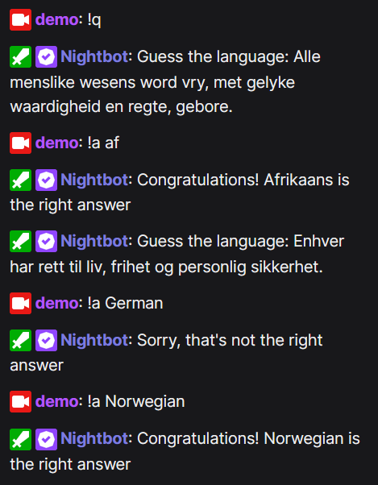

# Text language guesser

PHP backend for REST calls to a language guessing game; intended for integration by Nightbot, a Twitch bot.

***

**ARCHIVED** in favor of [ljacqu/NightbotQuiz](https://github.com/ljacqu/NightbotQuiz), which uses a database,
it can run multiple quizzes for different people, and it saves answer by different people before solving the question.

***

State is saved in files and may be susceptible to rare timing issues, e.g. if a question is answered and a new
question is requested in the same second.

## Setup
- Change the API secret in ./conf/config.php
- Add the commands as detailed below

### Nightbot commands

Add the commands given in the table below at https://nightbot.tv/commands/custom.
Replace `https://example.org/ext/lang` with the URL where this is hosted; replace `CHEESE` with your actual API secret.

| Command | Message |
| ------- | ------- |
| !langs  | See https://example.org/ext/lang |
| !q      | `$(eval const api = $(urlfetch json https://example.org/ext/lang/poll.php?secret=CHEESE&variant=$(querystring)); api.result)` |
| !a      | `$(eval const api = $(urlfetch json https://example.org/ext/lang/answer.php?secret=CHEESE&a=$(querystring)); api.result)` |

A new question can be forced by running `!q new` after a timeout you can configure in config.php.

You can use other command names; just change the values in config.php and your new names will be used everywhere.

Hint: If you want to add aliases like !answer and !question, copying the messages instead of using Nightbot's aliases
might work out better—I haven't been able to forward the arguments properly!

### Timer

With the above commands, your viewers will have to run `!q` to obtain new questions. You can add a timer to Nightbot to get a new question.

Go to https://nightbot.tv/timers and add a new timer:
- Name: Languages guess
- Message: empty
- Interval: Whatever you want
- Chat lines: Whatever you want :smile: (Suggestion: the minimum)
- Alias: `!q timer`

### Manual timer

Since the Nightbot timer cannot be run more than every five minutes, a lot of timing issues can happen, i.e. there can be a delay of almost
ten minutes depending on when a user solves a question and on your configured timeouts. To counter this, you can keep `regular_poll.php?secret=CHEESE` 
(replacing CHEESE with your actual API secret) open in a browser tab. It runs `!q timer` manually in smaller intervals and sends
the message to Nightbot whenever needed.

You can configure the timeouts in config.php to not have too many messages!

Note that running this manual timer means you have to register an application to Nightbot at https://nightbot.tv/account/applications:
- Name: guesslang (or whatever you want)
- Redirect URIs: `https://example.org/ext/lang/obtain_token.php` (where `https://example.org/ext/lang` is where your backend is hosted)

Set the client ID and client secret that are generated to the properties in config.php. Then, open `regular_poll.php` as mentioned above,
and follow the link to obtain a token that is linked in an error message.

Make sure that you don't have a **Nightbot timer running alongside** to prevent timing conflicts (i.e. choose to use the Nightbot timer,
or use the regular_poll.php page, but not both at the same time).

## Adding new texts

Modify the text lines in `data/texts.php`
- Do not change the starting PHP code
- You can write comments by starting a line with `#`—such lines will be ignored
- Run validate_data.php and fix any errors

### Adding new languages

Modify `data/langs.php`. Note that the entire code base assumes that languages have a two-letter code. Do not use codes of any other length!

## Technical overview

### Files
- `answer.php` is called by the !a command to process answers
- `index.php` shows past questions and the possible languages so that you can offer a list of languages to your users
- `poll.php` is used by the !q command and can be called from a timer
- `regular_poll.php`: See "Manual timer"
- `validate_data.php` should be run whenever you add new texts or languages

### Folders
- /conf/ holds configurations (config.php) that you should change, and other state that is automatically saved.
- /data/ has the quiz questions: langs.php defining the languages, texts.php holding the texts to guess.
- /inc/ is PHP code included in many of the files.

The /conf/ folder is separate from the /data/ folder because it is "more sensitive"—you don't want to commit any secrets, nor
do you want to commit the current state of the questions.

### Nightbot specifics
The user that solves the answer is inferred by a HTTP header specific to Nightbot. You can change the logic
in `answer.php`, e.g. by hardcoding it to a string like "Unknown". While the user that solved the answer is saved, this
information is not used or displayed anywhere at the moment.
